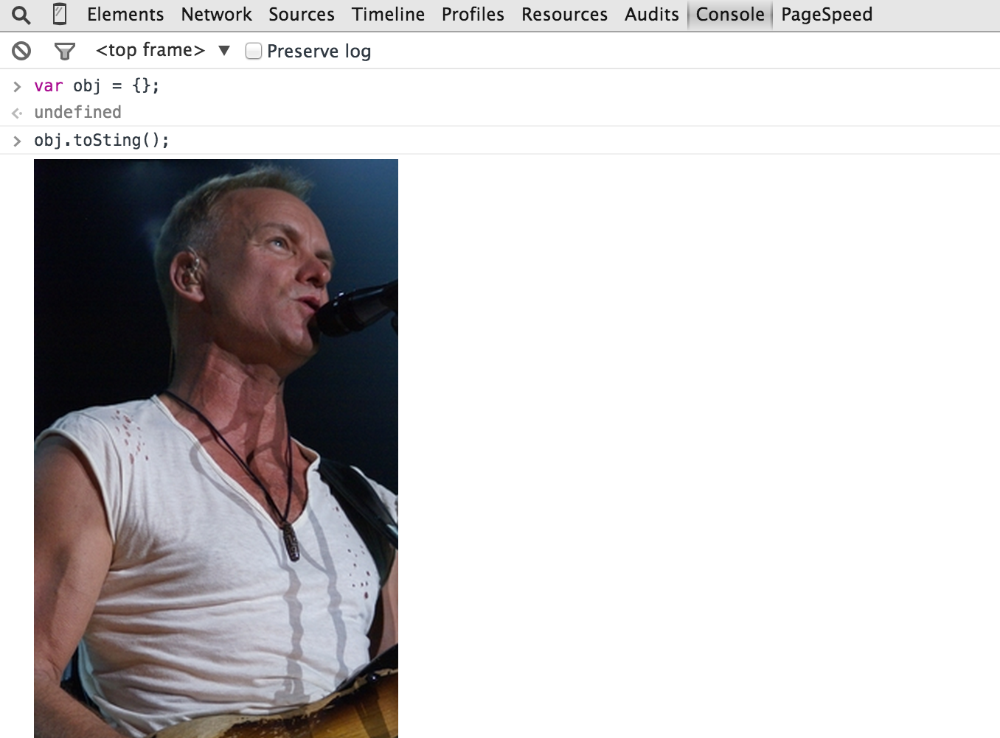

# Object.toSting()

Extend `Object.prototype` with the method `toSting()`, which logs an image of Sting to the development console.

Works at least on recent versions of Chrome.

## Image Credits

Lionel Urman, [CC-BY-SA 3.0](http://creativecommons.org/licenses/by-sa/3.0)

https://en.wikipedia.org/wiki/Sting_(musician)#/media/File:Sting_ThePolice_2007.jpg
